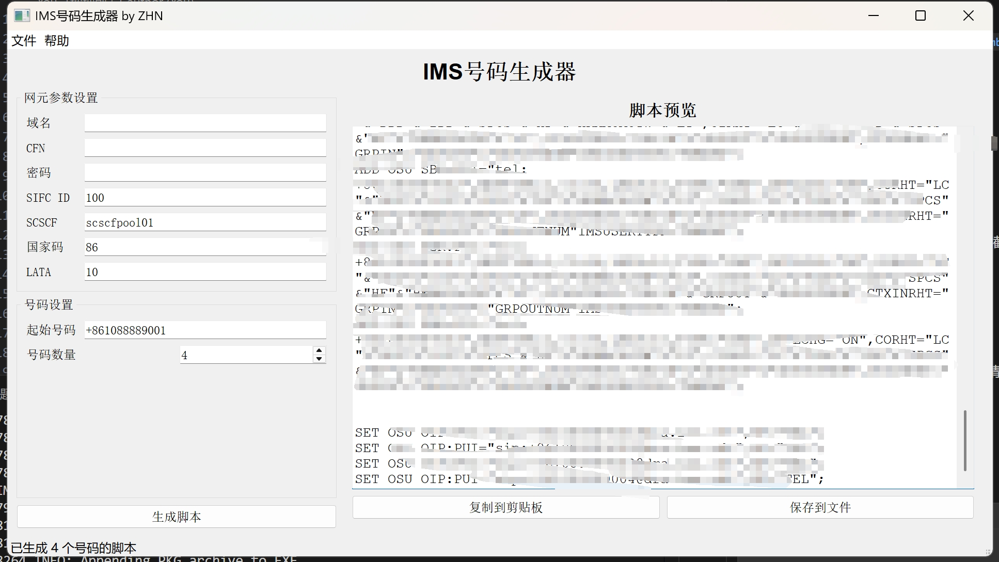

# IMS号码生成器

这是一个用于IMS服务器的SIP号码生成工具，可以根据特定规则生成放号脚本。



## 功能特点

- 生成USPP网元放号脚本
- 生成ENUM网元放号脚本
- 生成SSS网元放号脚本
- 自定义号码范围和参数
- 导出生成的脚本到文件
- 保存和加载用户配置

## 安装与使用

### 方法1：从源代码运行

1. 克隆仓库：
```bash
git clone https://github.com/yourusername/IMS-number-maker.git
cd IMS-number-maker
```

2. 安装依赖：
```bash
pip install -r requirements.txt
```

3. 运行程序：
```bash
python main.py
```

### 方法2：使用打包版本

1. 从[Releases](https://github.com/yourusername/IMS-number-maker/releases)页面下载最新版本
2. 解压缩文件（如果是压缩包）
3. 运行可执行文件 `IMS号码生成器.exe`（Windows）或 `IMS号码生成器`（Linux/macOS）

## 打包说明

如果您想自行打包应用程序，可以使用以下方法：

### Windows系统：

1. 双击运行 `build.bat`
2. 根据提示选择打包方式（1或2）
3. 等待打包完成

### Linux/macOS系统：

1. 打开终端，进入项目目录
2. 执行命令 `chmod +x build.sh` 赋予执行权限
3. 执行 `./build.sh`
4. 根据提示选择打包方式（1或2）
5. 等待打包完成

## 项目结构

```
IMS-number-maker/
├── main.py                 # 程序入口
├── requirements.txt        # 依赖包列表
├── README.md               # 项目说明
├── build.bat               # Windows打包脚本
├── build.sh                # Linux/macOS打包脚本
├── IMS-number-maker.spec   # PyInstaller配置文件（文件夹模式）
├── IMS-number-maker-onefile.spec # PyInstaller配置文件（单文件模式）
├── src/                    # 源代码目录
│   ├── ui/                 # UI相关模块
│   │   ├── main_window.py  # 主窗口
│   │   ├── widgets.py      # 自定义控件
│   │   └── __init__.py     # 包初始化文件
│   ├── core/               # 核心功能模块
│   │   ├── generator.py    # 脚本生成器
│   │   ├── validator.py    # 验证器
│   │   └── __init__.py     # 包初始化文件
│   ├── utils/              # 工具模块
│   │   ├── config.py       # 配置管理
│   │   ├── file_handler.py # 文件处理
│   │   ├── logger.py       # 日志管理
│   │   └── __init__.py     # 包初始化文件
│   └── __init__.py         # 包初始化文件
└── screenshots/            # 截图目录（用于README）
```

## 贡献指南

欢迎贡献代码、报告问题或提出改进建议！请遵循以下步骤：

1. Fork 本仓库
2. 创建您的特性分支 (`git checkout -b feature/amazing-feature`)
3. 提交您的更改 (`git commit -m 'Add some amazing feature'`)
4. 推送到分支 (`git push origin feature/amazing-feature`)
5. 开启一个 Pull Request

## 许可证

本项目采用 MIT 许可证 - 详情请参阅 [LICENSE](LICENSE) 文件

## 联系方式

如有任何问题或建议，请通过以下方式联系我：

- 邮箱：your.email@example.com
- GitHub Issues：[https://github.com/yourusername/IMS-number-maker/issues](https://github.com/yourusername/IMS-number-maker/issues) 